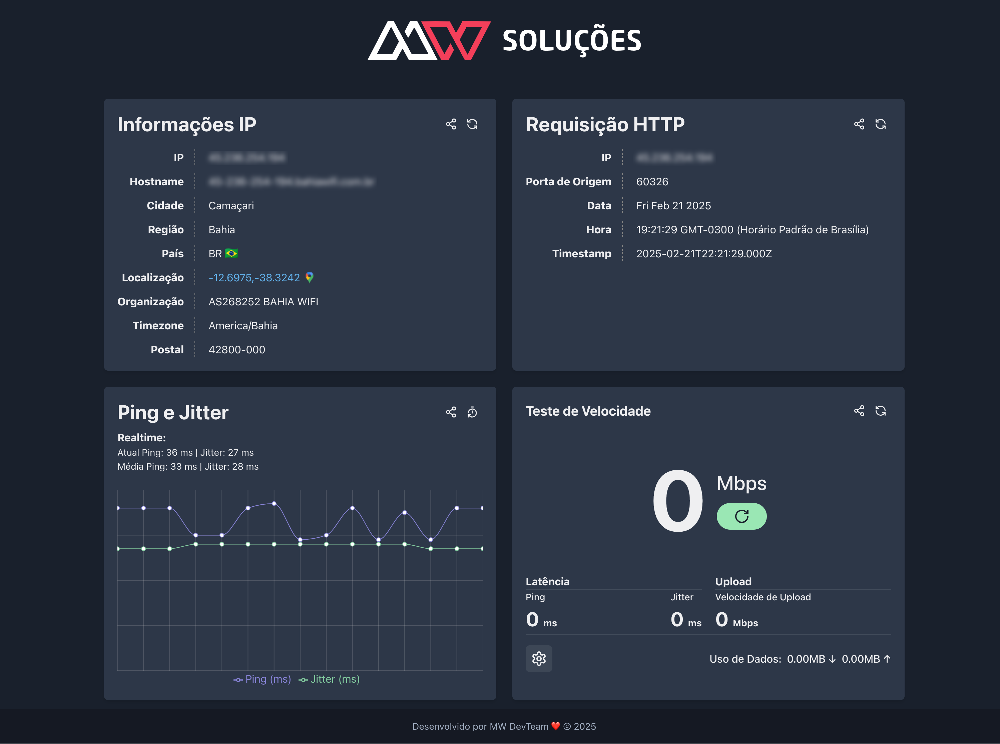

# MinhaConexão

Bem-vindo ao **MinhaConexão**! 🚀

Este projeto é uma aplicação web que permite aos usuários testar a largura de banda da sua conexão de internet. Utilizamos React e Chakra UI para criar uma interface de usuário moderna e responsiva.

## Funcionalidades

- **Teste de Largura de Banda**: Inicie um teste de velocidade da sua conexão de internet.
- **Interface Amigável**: Interface de usuário intuitiva e fácil de usar.
- **Feedback Visual**: Indicadores de carregamento e desativação de botões durante o teste.

## Tecnologias Utilizadas

- **React**: Biblioteca JavaScript para construção de interfaces de usuário.
- **Chakra UI**: Biblioteca de componentes para React que facilita a criação de interfaces modernas e responsivas.
- **TypeScript**: Superset do JavaScript que adiciona tipagem estática ao código.

## Como Rodar o Projeto

1. Clone o repositório:

   ```bash
   git clone https://github.com/seu-usuario/minha-conexao.git
   cd minha-conexao
   ```

2. Instale as dependências:

   ```bash
   npm install
   ```

3. Inicie o servidor de desenvolvimento:

   ```bash
   npm start
   ```

4. Abra o navegador e acesse:

   ```
   http://localhost:3000
   ```

## Estrutura do Projeto

- **src/components**: Componentes reutilizáveis da aplicação.
- **src/pages**: Páginas principais da aplicação.
- **src/styles**: Arquivos de estilo.
- **src/utils**: Funções utilitárias.

## Captura de Tela

Aqui está uma captura de tela da aplicação em ação:



## Contribuindo

Contribuições são bem-vindas! Sinta-se à vontade para abrir issues e pull requests.

1. Faça um fork do projeto.
2. Crie uma nova branch:

   ```bash
   git checkout -b minha-nova-feature
   ```

3. Faça suas alterações e commit:

   ```bash
   git commit -m 'Adiciona nova feature'
   ```

4. Envie para o repositório remoto:

   ```bash
   git push origin minha-nova-feature
   ```

5. Abra um pull request.

## Licença

Este projeto está licenciado sob a licença MIT. Veja o arquivo [LICENSE](./LICENSE) para mais detalhes.

---

Feito com ❤️ por [Isaac Diniz](https://github.com/drksbr)
